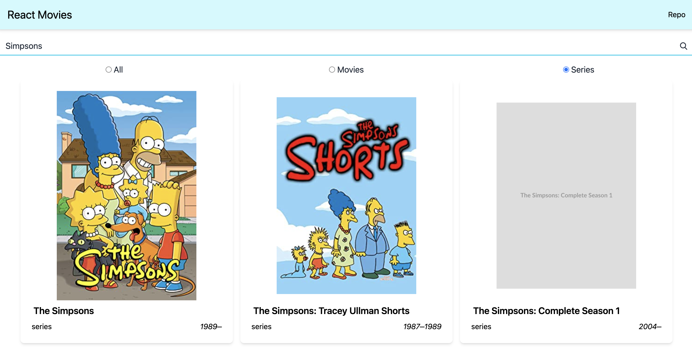

# "Movies" React learning project



## Description

This is a React-learning-purposes project - "Movies".

It shows a list of movies, searching by title entered by user in search field.

Each movie is rendered as card with title, movie type (movie, series), release date and poster image.

Project has a little adaptive design.

The tutorial of creating simillar type project - https://stepik.org/course/114197/

## Features

- API fetching.
- Movie cards.
- Searching
- Filtering by type.
- Adaptive design using Tailwind classes.

## What frameworks/libraries are used

- Vite - development environment. [vitejs.dev](https://vitejs.dev)
- React - UI development library. [react.dev](https://react.dev)
- Tailwind - utility-first CSS framework. [tailwindcss.com](https://tailwindcss.com)

## What data is used

Movies data fetched from [OMDb API](http://www.omdbapi.com).

You can read information about api request on their site - [omdbapi.com](http://www.omdbapi.com).
_Requires registration in order to get API key._

## Instalation

:warning: The project uses vite as development environment. Running commands differ from commands in CRA (Create-react-app).
See "Running" section below.

1. Pull this hub to your PC.
2. Run the command `npm install` or `npm i` in project directory.

## Running

1. Register on [omdbapi.com](http://www.omdbapi.com) and get API key for you.
2. Create `.env.local` file in project directory.
3. In `.env.local` file write the following:

```
VITE_API_KEY=[Your API key]
```

4. Run the command `npm run dev` in project directory.
   This command runs _localhost_ only development server. If you want to expose it, run `npm run dev -- --host`.

## Building

1. Run the command `npm run build` in project directory.
2. Compiled files will be in `dist` directory.

---

Have a nice development time!
